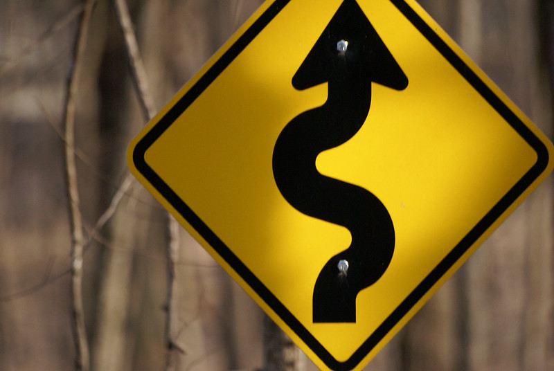
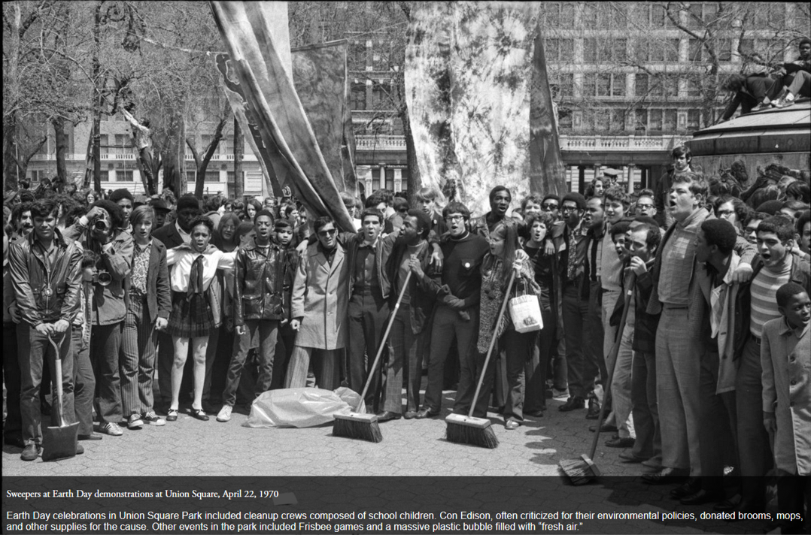

I decided to share some of my personal journey to help people see that not everyone's career path is picture-perfect or follows a clearly proscribed order. I hope that my story may be encouraging for those taking a less linear career pathway or wondering if they should take that leap of faith and an embark on a new path. 

 *Winding Path by Memories Visual Depot licensed with CC BY-ND 2.0. To view a copy of this license, visit https://creativecommons.org/licenses/by-nd/2.0/*

I grew up in New York City. A first generation college student and immigrant. My career track was not very linear at all, and there were many potholes along the way. I spent a lot of time as a kid in Central Park and the many museums of NYC, including one of my favorites, the American Museum of Natural History. I was fortunate as a young girl that my mom always found a way for our family to escape to rental house on the seashore or a lake for a few weeks every summer. I loved swimming, body surfing, and fishing, and was a total bookworm as a kid. I celebrated Earth Day. I attended public schools, including the high schools you have to test into (P.S. 6, Hunter College High School, Stuyvesant High School), I fell in love with biology in high school, but then dropped out of tenth grade, failing all my classes except geometry (it was very complicated at home). I persevered and eventually graduated from City-As-School and applied to colleges. 

 *Source: https://www.archives.nyc/unlikely-historians/save-the-earth*

I attended Hampshire College, a very progressive college in Massachusetts. I managed to garner scholarships, work study, and student loans to cover most of the expenses; my family helped out also. I selected a concentration in photography and film, and worked part-time at the college switchboard (seriously, they had one!). I took a semester off to do an internship with a photojournalist, but at the last minute my sponsor backed out. I ended up working in restaurants while developing my photography portfolio independently. I set up my tiny studio apartment so that it could be temporarily converted into a darkroom when I wanted to print my photographs. I was no longer convinced I needed to finish college if I going to be an artist. I enjoyed the creative energy of the city and the art scene. 

I worked as a waitress, bartender, cook to support myself. The work as a cook ended up being very creative. I worked my way up the ranks in a small but very popular restaurant that had a new menu every day. I contributed to developing the daily menus and testing out recipes for the cookbook the owners published. I continued to work with them as they opened a second restaurant, and eventually managed their growing catering division. (The *[original restaurant](http://www.goodenoughtoeat.com/)* is still in business in a new location).

In the midst of all this, I fell in love, got married, and had a son. I reconnected with my interests in biology and the environment. I decided to return to school to pursue a science journalism career. I felt I had something to offer as a translator and communicator of science, especially in the environmental sciences. I enrolled in Brooklyn College in a special evening baccalaureate program for working adults, figured out some daycare, and worked part-time for an urban environmental center. My husband and I managed to juggle work, school, and childcare, with some help from my mom too. 

I majored in biology to get my science background dialed in. Along the way I became awe-struck by the wonders of marine life and ecology. Some of my professors urged me to go to graduate school and become a scientist. I was very unclear about what that involved,exactly, but they were very persuasive and encouraging. So I decided to give it a try. My last year I worked on a research project with my ecology professor in the salt marshes of the Jamaica Bay Wildlife Refuge. The thought of writing a dissertation was still incredibly intimidating. However, I was enjoying doing science and imagined I would learn what I needed to know along the way. 

I took the GREs and applied to about 8 PhD programs. I had good grades, enthusiastic letters of recommendation, and strong GRE scores, except for one which was abysmal (and it was decidedly not a predictor of my quantitative abilities and skills). I applied for the NSF predoctoral fellowship (as it was know then). That one abysmal GRE score meant I didn't rank high enough to merit a fellowship award. I didn't really know I needed to reach out individual professors and talk with them either. Nonetheless, I was tentatively accepted into a couple programs, contingent on getting an NSF award. That didn't happen, obviously. In the end, I received two offers. One included a promise of several years of teaching assistant support and tuition waivers and the professors paid for me to fly out and visit with them. Another only promised one year of TA support and it was not clear what would happen after that. With a family in tow, you can imagine which offer I took. And it was one of the best decisions of my life.

I took a giant leap of faith, moved my family across the country, and started my PhD when my son was 5 years old. We were lucky to have family and in-laws who could provide a financial safety net (which we relied on a number of times). I benefited from wonderful PhD mentors, worked hard, wrote grant proposals, applied for scholarships, worked as a teaching and research assistant, took out student loans (still paying those off), and had some decent luck along the way. 

I did finally get some love from NSF as a postdoc. I was awarded an international postdoctoral fellowship to do research in Chile. I was fortunate to have a supportive and adventurous family who let me move us all to Chile for two years. It turned out to be the exact same two years when the former Chilean dictator, Augosto Pinochet, was detained in England as Spain attempoted to extradite him to face charges of human rights violations. My son ended up attended a small public school on the coast, and learned how to bodyboard with the local kids. He also learned to speak Spanish including all the best Chilean slang and curse words. It was an extrodinary adventure and learning experience for us all. 

My teenage self could never have imagined I would end up as a university professor and a scientist. And no one would plan to take a pathway like mine to end up where I am today. However, I can honestly say that every twist and turn has enriched my life and understanding in an important way. 

